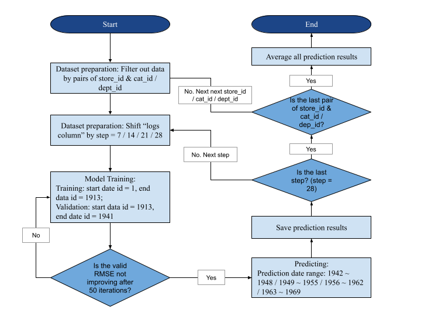

# Walmart-time-series-prediction
## Project Introduction
This team project for my predictive analysis course uses the dataset from the expired Kaggle competition [M5 Forcasting - Accuracy](https://www.kaggle.com/competitions/m5-forecasting-accuracy/overview). We aim to predict sales for the next 28 days, leveraging sales data on stores in California, Texas, and Wisconsin, including item details, departments, product categories, and store information.
## Technical Structure
Given that we are dealing with the prediction of daily sales based on historical sales data, we have to  take the dynamic sales patterns over time into consideration. We employ the following techniques as our main structure of modeling to achieve accurate forecasts.
1. Time Series
Decompose the time series into its components of trend and seasonality. This helps with understanding the underlying patterns and capturing the cyclic nature of sales.
2. Model Selection Strategy
Explore models including LightGBM and LSTM networks for dealing with more intricate relationships within the data. In addition, we consider creating an ensemble of multiple models to ensure more consistent performance across various scenarios.
(Given the better performance of LightGBM, I've exclusively included the LightGBM solution here.)

## LightGBM (Light Gradient-Boosting Machine)
### Methodology
Addressing time series prediction challenges necessitates a comprehensive understanding of the trends and patterns inherent in states, categories, or departments over time. Consequently, we first initiated a thorough trends analysis. Subsequently, leveraging insights from this analysis, we undertook feature engineering to capture the sales trends over time. Recognizing the variability of sales trends across products, locations, and time spans, we developed distinct LightGBM (Light Gradient-Boosting Machine) models for each category and department to capture sales patterns within different states and time spans. Finally, we aggregated the prediction results from these models to formulate the conclusive prediction.
### Data-Preprocessing
Three datasets are first downsized to reduce memory usage and computation cost. The sales_train dataset initially adopts a wide format. We subsequently transformed into a long format by melting the data. Following this, we merged three datasets into a single table using the "id" column as the key identifier. 
While merging the tables, we observed zero sales in the sales_train dataset, attributed to items not yet released. To optimize memory usage, we pruned the dataset by excluding rows where the item sales dates preceded their respective product release. 
### Feature Engineering
1. Time-based Features  
Temporal features, including day of the week, month, quarter, and year, were extracted from the timestamp to capture seasonal patterns. Additionally, lag features were created by shifting the time series data, representing values at previous time steps to capture past sales patterns. In total, 15 days of lag features were included.
2. Rolling Statistic  
We generated rolling mean, rolling standard deviation, the difference between rolling means, and rolling maximum of sales. These features serve to smooth short-term fluctuations and emphasize long-term trends. Utilizing rolling windows of 7, 14, 30, 60, and 180, we incorporated these variations into our analysis.
3. Price  
We extended the application of a similar methodology of rolling statistics to the price column, wherein we computed the maximum, minimum, standard deviation, mean, normalized value, as well as monthly and yearly momentum of prices categorized by store_id and item_id. These features captured variations in prices across stores and items. The normalization of prices and the derived statistical metrics further elucidated the relative pricing dynamics over distinct time intervals.
4. Time Since Last Event  
The days preceding or following SNAP events can significantly impact sales. To quantify the descending or ascending strength of this influence, we have introduced columns indicating the number of days since the last SNAP event.
5. Mean Encoding  
We employed mean-encoding to address categorical columns, including item_id, dept_id, cat_id, and state_id. Recognizing the relevance of these columns to sales, we applied mean encoding to transform categorical data into numerical representations. This technique involves replacing each category with the mean sales value associated with that specific category.
### Model Building
To address sales variations across states, categories, and departments, we created models for every distinct pairing of states and categories, as well as states and departments. 
Next, we employed the same dataset for training models and forecasting sales using various step sizes. We adjusted the lag columns according to the specified step. For example, when predicting with a step size of 7, we shifted the lag columns by 7, 14, 21, and 28 in each iteration. This approach enables the utilization of the most recent historical information for prediction, instead of shifting the entire model to accommodate the 28-day period. 
After generating predictions using different models, we ensemble the results by concatenating them together and averaging them. We tried step = 2, step = 4, step = 7, with Weighted Root Mean Squared Scaled Error (RMSSE) 0.53199, 0.64806, and 0.54488  respectively.
Using a step size of 7 as an example, our model training and prediction process is as follow:

